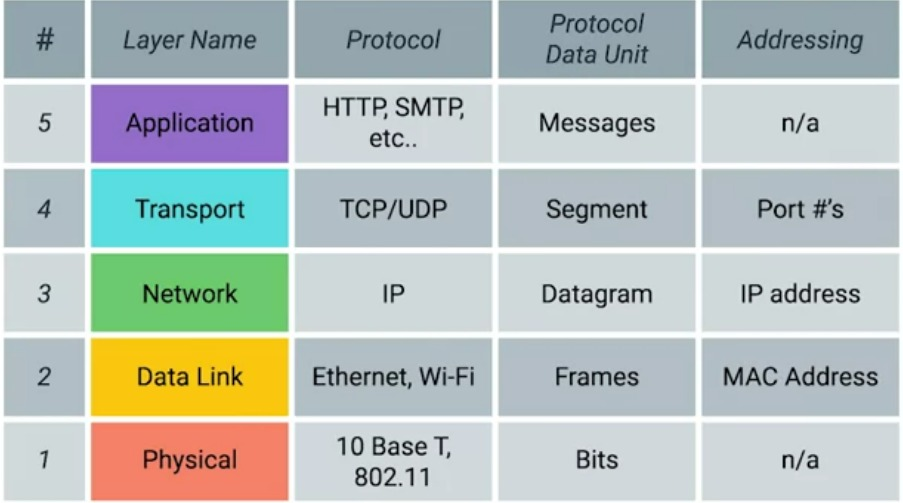
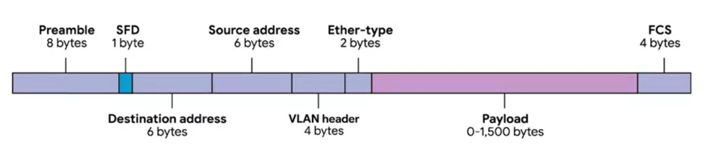

# Week - 1 Introduction to Networking.

### <b>Protocol</b>
A defined set of standards that computers must follow in order to communicate properly.

In the course we will be learning about the 5 Layer model of networking.

The 5 layers are:  
1. Physical Layer
1. Data Link
1. Network
1. Transport
1. Application

  

There is also a 7 layers model called OSI(Open systems Interconnection) reference model.

### <b>Physical Layer</b>
Represents the physical devices that interconnect computers.

### <b>Data Link</b>
Responsible for defining a common way of interpreting these signals so network devices can communicate.

### <b>Crosstalk</b>
When an electric pulse on one wire is accidentally detected on another wire.

### <b>Network</b>
Allows different networks to communicate with each other through devices known as routers.

### <b>Hub and Switch</b>
Hub is a physical layer device that allows for connections from many computers at once. It can communicate one time each which when lot of bits are transferred its creates data collision. 
  
Switch is a data link layer device which can inspect the where data is meant to be sent on the network which reduceses data collision.  
  
Hub and Switch are used to connect computers on a single network, usually referred to as a LAN(Local Area Network).

### <b>Routers</b>
A device that knows how to forward data between independent networks. It operaters on Layer 3 that is Network.

### <b>Border Gateway Protocol(BGP)</b>
Routers share data with each other via this protocol, which let them learn about most optimal paths to forward traffic.

### <b>Modulation</b>
A way of varying the voltage of this charge moving across the cable.  

In computers this kind of modulation is known as Line Coding. 

### <b>Ethernet</b>
When the Ethernet technology was invented there were no Hub or Switches. So, at that time two computer connected with the help of ethernet would face data collision which results in loss of data.   

To solve this problem Ethernet as a protocol solved this problem by using a technique known as carrier sense multiple access with collision detection(CSMA/CD).

### <b>CSMA/CD</b>
Used to determine when the communication channels are clear, and when a device is free to transmit data.

### <b>MAC address (Media Access Control address)</b>
A global unique identifier attached to an individual network interface.  
  
It's a 48 bits number normally represented by six-groupings of two hexadecimal numbers.  
  
MAC address is split into two parts first three octet are given to hardware manufactures and is called as OUI(Organizationally Unique Identifier).

### <b>Dissecting an Ethernet Frame</b>

