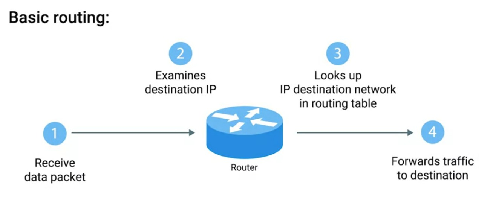

# Week - 2 - The Network Layer

### <b>IP Address</b>
It is basically distributed to large organizations instead of hardware vendors. IP address belongs to networks, not to the devices attached to those network. IP address is divided into two part Host ID and Network ID. It also has a subnet ID.
  
  

### <b>DHCP(Dynamic Host Configuration Protocol)</b>
It is a protocol used to assign IP address to a device connected to the network. IP assigned this way is know as Dynamic IP address.

### <b>IP Datagram</b>
A highly structured series of fields that are strictly defined.

### <b>ARP(Address Resolution Protocol)</b>
A protocol used to discover the hardware address of a node with a certain IP address. It broadcast the message to get the MAC address for a particualr IP address. The broadcast message is FF:FF:FF:FF.

### <b>Subnetting</b>
The process of taking a large network and splitting it upto many individual and smaller subnetworks, or subnets.

### <b>Subnet Masks</b>
32-bit numbers that are normally written out as four octets in decimal. It has two parts mask and zeros. Mask tells us what to ignore when computing the Host ID and part with zeros tell us what to keep. The subnet mask help the router to know about the subnet ID.

### <b>Demarcation Point</b>
To describe where one network or system ends and another one begins.

### <b>CIDR(Classless Inter-Domain Routing)</b>
It combines network ID and subnet ID into one.

### <b>Router</b>
A network device that forwards traffic depending on the destination address of that traffic.  
 
  

### <b>Routing Tables</b>
They have four columns:
1. Destination Network -  contains IP address and Subnet or both in single CIDR notation.
1. Next Hop - IP address of next router which receives the next stop.
1. Total Hop - Keeps track of how far the next targeted router is.
1. Interface

### <b>Routing Protocols</b>
Routing protocols fall into two main categories:
1. <b>Interior gateway protocols</b>
    - Link state routing protocols.
    - Distance-vector protocols.
1. <b>Exterior gateway protocols</b>

### <b>IANA (Internet Assigned Numbers Authority)</b>
A non-profit organization that helps manage things like IP address allocation. It is also responsible for ASN(Autonomous System Number) allocation.

### <b>Non-Routable address space</b>
Any body can use these addresses.

