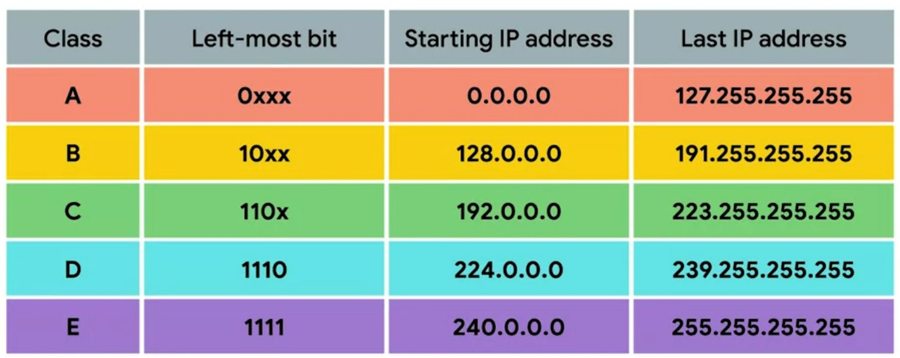
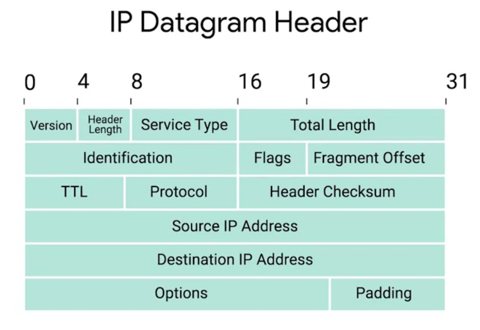

# Week - 2 - The Network Layer

### <b>IP Address</b>
It is basically distributed to large organizations instead of hardware vendors. IP address belongs to networks, not to the devices attached to those network. IP address is divided into two part Host ID and Network ID.

### <b>DHCP(Dynamic Host Configuration Protocol)</b>
It is a protocol used to assign IP address to a device connected to the network. IP assigned this way is know as Dynamic IP address.

### <b>IP Datagram</b>
A highly structured series of fields that are strictly defined.

### <b>ARP(Address Resolution Protocol)</b>
A protocol used to discover the hardware address of a node with a certain IP address.

### <b>Subnetting</b>
The process of taking a large network and splitting it upto many individual and smaller subnetworks, or subnets.

### <b>Subnet Masks</b>
32-bit numbers that are normally written out as four octets in decimal. It has two parts mask and zeros. Mask tells us what to ignore when computing the Host ID and part with zeros tell us what to keep. The subnet mask help the router to know about the subnet ID.
