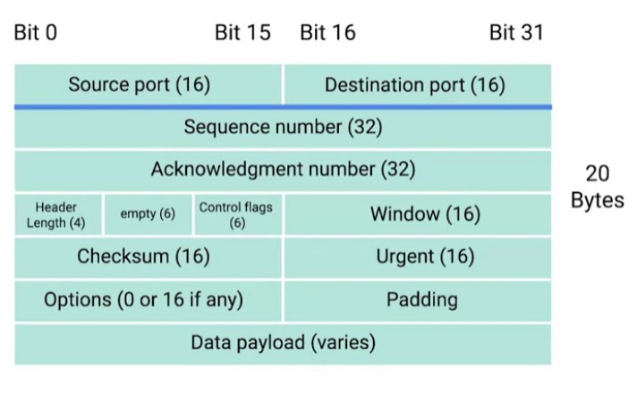

# Week - 3 - Transport and Application Layer.

### <b>Transport Layer</b>
Allows traffic to be directed to specific network applications.

### <b>Port</b>
A 16-bit number that's used to direct traffic to specific services running on a networked computer.  

<b>TCP Header</b>

The Control flag field has 6 flags:
1. URG(Urgent) - the value of one here indicates that the segment is considered urgent and that the urgent pointer field has more data about this.  
  
1. ACK(Acknowledged) - A value of one in this field means that the acknowledgement number field should be examined.  
  
1. PSH(Push) - The transmitting device wants the receiving device to push currently-buffered data to the application on the receiving end as soon as possible.  
  
1. RST(Reset) - One of the sides in a TCP connection hasn't been able to properly recover from a series of missing or malformed segments.  
  
1. SYN(Synchronize) - It's used when first establishing a TCP connection and makes sure the receiving end knows to examine the sequence number field.  
  
1. FIN(Finish) - When this flag is set to one, it means the transmitting computer doesn't have any more data to send and the connection can be closed.

### <b>Connection-oriented protocol</b>
Establishes a connection, and uses this to ensure that all data has been properly transmitted. I.E TCP.

### <b>Connectionless protocols</b>
That is UDP(User Datagram Protocol)

### <b>Firewall</b>
A device that blocks traffic that meets certain criteria.

### <b>Going all in unison</b>
First of all to establish a connection to a node on another network a mutual three-way handshake should be done to agree on receiving and sending data. This is done by Transport Layer. Transport layer ensure that our data goes to intended application. 

The TCP header made by Transport layer is loaded to IP header which is made at Network layer. Network layer work is to provide data to reach to the destination and return back for which IP address, allocated to every node by router, and MAC address which is the physical address of the node provided by hardware manufacture is needed. 

Once our IP header is also ready we need to send it to our network to forward it to appropriate destination. To achieve this either wireless or ethernet will be used. To send them through, the IP header is put into the payload of ethernet frame. 

Once, our ethernet frame is ready now its time for our Physical layer to send it. To send 0 and 1 over electric voltage is used. The voltage is altered with the technique called Modulation. The corresponding receiver has a  decoder to decode the modulated voltage and get the corresponding value. 

Once, data is reached to the destination network, assuming the work of physical layer is done, the step described above are done in reverse order to make the data and information packed into transport layer to the destination. 

Each and every time the frame is hopped over to other network a checksum check is done to make sure data is intact and it isn't corrupted. Along with that a new frame is made and the TTL field of the ethernet frame is reduced by 1. The standard value for TTL is 64. 

Router use what is know as routing table to route the traffic to intended node. Router has two interface and they are connected to a network. Router stores the IP address and Mac address of the nodes connected to it in the routing table.
