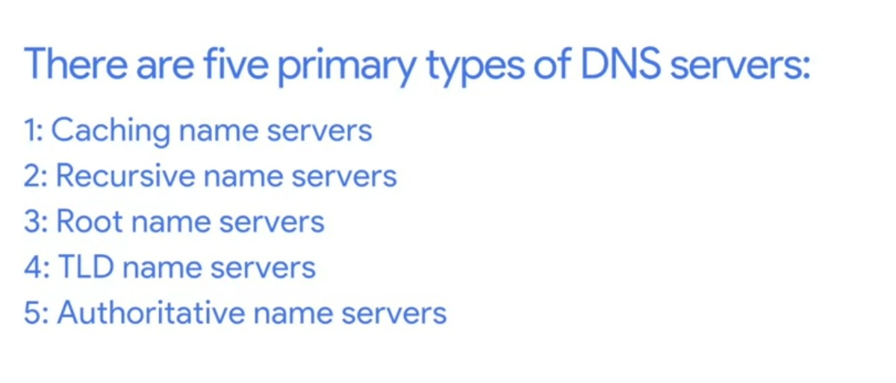
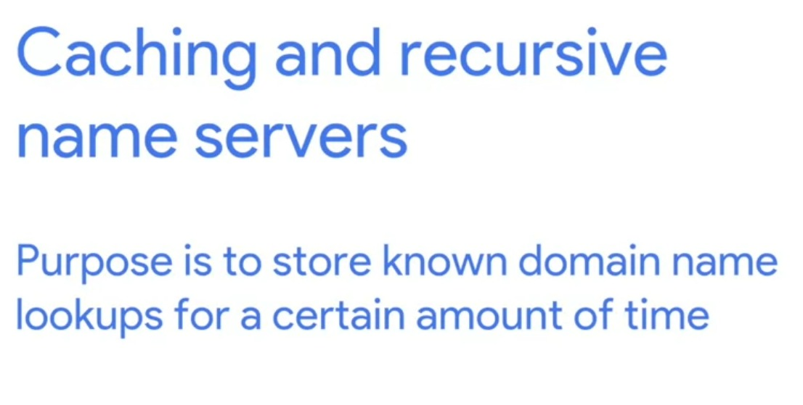
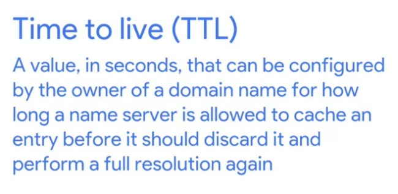
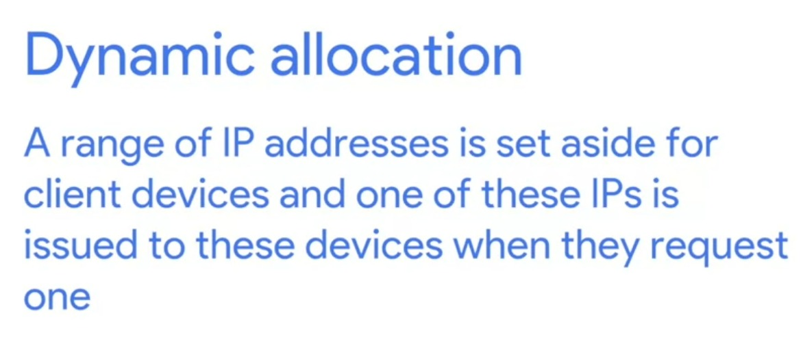
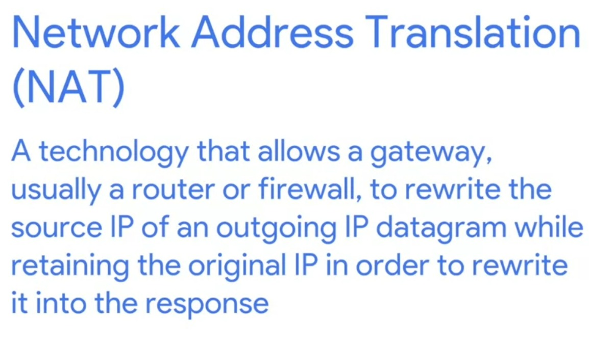

# Week - 4 - Networking Services

### <b>DNS - DOMAIN NAME SYSTEM</b>
A global and highly distributed network service that resolves strings of letters into IP addresses for you. Basically, instead of we remembering IP addresses of each website we give them names and DNS match the name to the storage and then gives the corresponding IP address.

<b>The process of making a Domain name into IP address is know as Name Resolution</b>  
  
  
  
  
It is provided by ISP.  
  
  
  

  
### <b>Anycast</b>
A technique that's used to route traffic to different destinations depending on factors like location, congestion, or link health.  

### <b>CNAME</b>
A CNAME record is used to redirect traffic from one domain name to another.

### <b>DHCP</b>
  

### <b>NTP(Network time protocol) servers</b>
Used to keep all computers on a network synchronized in time.

### <b>NAT(Network Address Translation)</b>

### <b>VPN(Virtual Private Network)</b>
