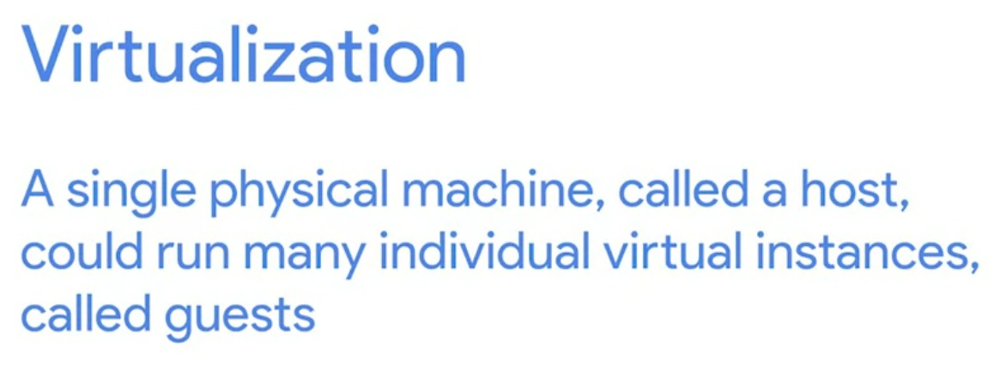
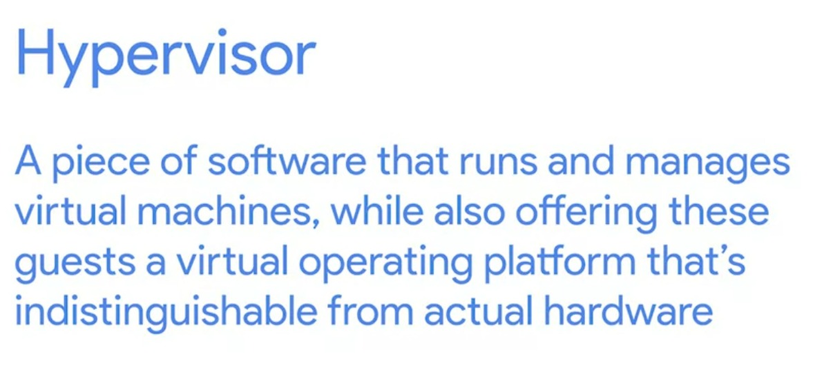

# Week - 6 - Introduction to troubleshooting and the future of networking

### <b>ICMP - Internet Control Message Protocol</b>
The protocol is mainly used router or remote host to communicate back to the origin of the transmission whenever a error occurs.  

### <b>Ping program</b>
ping program sends a ICMP echo request and if network is up and running it will send back a ICMP reply. 

### <b>Traceroutes</b>
A utility that let you discover tha path between two nodes, and gives you information about each hop along the way.  
windows tools:
1. tracert ip/domain  
1. pathping ip/domain 

macos/linux:  
1. traceroute  
1. mtr  

### <b>Port connection testing tools</b>
Windows:  
1. Test-NetConnection - Test-NetConnection -port

MacOS/Linux:  
1. netcat - (nc -z -v host port)

### <b>Name resolution tools</b>
1. nslookup - nslookup hostname

### <b>Public DNS servers</b>
Name servers specifically set up so that anyone can use them, for free.  

### <b>Loopback address</b>
A way of sending network traffic to yourself. 127.0.0.1  
For IPv6 loopback address is ::1/128.
  
### <b>Virtualization</b>
  
  
