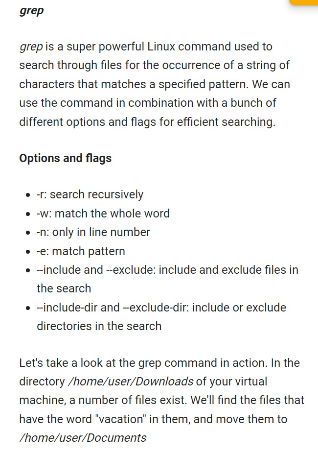

# Week - 1 - Introduction to operating systems and becoming a power user.

### <b>Commands</b>
Windows:  
- <b>Get-Help command flags</b> -> get help for any command
    - flags
        - -full - for descriptive help on commands.
- <b>ls flags path</b>  ->  list directory 
    - flags
        - -Force - show hidden files
- <b>pwd</b> - print working directory
- <b>cd directoryName</b> - change directory
    - <b>~</b> - home directory
    - <b>.</b> - current directory
    - <b>..</b> - parent directory 
- <b>mkdir directoryname</b> - make a new directory
- <b>history</b> - lookup of previous commands.
- <b>clear</b> - clear output on screen.
- <b>cp filename destination_path</b> - copy file from one directory to another.
- <b>cp 'foldername' destination_path</b> - copy folder
    - but to copy the content as well from folder we need to add -Recurse 
    - to show some output on screen we use -Verbose
- <b>mv</b> - help us to move or rename a file or folder
- <b>rm/remove</b> - remove a file or directory.
    - flags
        - -Force - use it when not enought previlages.
        - -Recurse - remove directory and its content.
- <b>cat fielname flags</b> - display content of a file. It show the whole content in one time.
    - flags
        - -Head total_lines - display top total_lines.
        - Tail total_lines - display last totatl_lines.
<b>more filename</b> - it also display the content of a file but in pagely manner. It counts page as size of the terminal.

Linux:
- <b>man command</b> - use it to see help on any command.
- <b>ls --flags</b>
    - help - help for the command.
    - -l - more about files in the directory.
    - -a - show hidden files.
- <b>mkdir directoryname</b> - make a new directory
- <b>history</b> - lookup of previous commands.
- <b>clear</b> - clear output on screen.
- <b>cp filename destination_path</b> - copy file from one directory to another.
- <b>cp 'foldername' destination_path</b> - copy folder
    - but to copy the content as well from folder we need to add -r
- <b>rm flags filename</b> - remove a file or directory.
    - flags
        - -r - remove directory and its content.
- <b>cat fielname</b> - display content of a file. It show the whole content in one time.
<b>less filename</b> - same like more command in windows but more functionality.
<b>head filename</b> - first 10 lines of the file.
<b>tail filename</b> - last 10 lines of the file.
<b>grep</b> - search words within a file.
