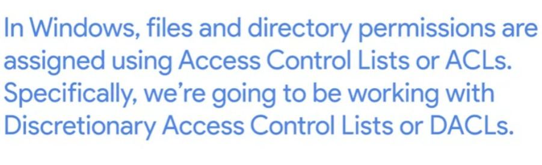
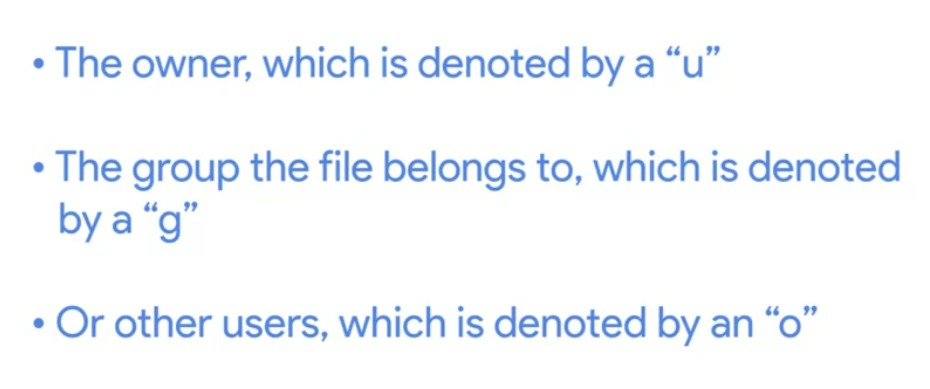

# Week - 2 - Users and Permissions

### <b>How to handle users, groups and group members through CLI in windows</b>
1. Get-LocalUser - gives list of users.
1. Get-LocalGroup - gives list of all the groups.
1. Get-LocalGroupMember groupname - gives list of members of the specified group.
1. <b>net user username 'newpassword' | net user username * | net user username /logonpasswordchg:yes J</b> - these are used to change a password using CLI. If we use * it will ask for password in next line instead of showing it on same line in first case.
1. net user username * /add - this adds a newuser through CLI.
1. net user username /del - delete's a user.

### <b>How to handle users, groups and group members through CLI in Linux</b>
1. cat /etc/passwd - to see list of users.
1. cat /etc/group - to see list of groups.
1. passwd username - change passwd for current user.
1. sudo passwd -e username - if we have root previlages we use -e which is expiry to let user reset the password on next start.
1. sudo useradd username - adds a user.
1. sudo userdel username - delete a user.

### <b>Permissions</b>

### <b>ICACLS</b>
icacls - a utility to check permission of a user on a file or directory and change it using CLI.

### <b>CHMOD</b>
Command to update file permissoin in Linux.  

<b>Character method</b>  
chmod u+rw filename  
chmod g+rx filename  
chmod o-x filename  
  
<b>Numerical Mode</b>
4 - read  
2 - write  
1 - execute  
chmod 754 filename - which will do rwxr-x-r--.  
  

<b>chown ownername filename</b>  
this command changes the owner name.  
chown owername filename.  
  

<b>chgrp newgroupname oldgroupname</b>  
this command change the group the file belong to.  
chgrp newgroupname oldgroupname