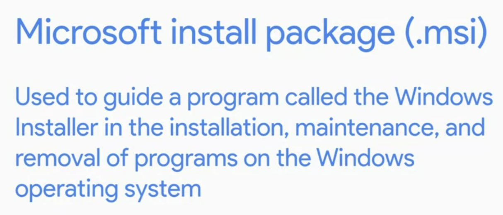

# Week - 3 - Package and Sofware Management.

### <b>Software Packages</b>
  
  
<b>Compression in Windows and Linux through CLI</b>  
Windows:  
Compress-Archive -Path sourcefolder newdestination/filname  
  
Linux:   
7z e zipfilename -> e is to extract. command to archive and unarchive. 

### <b>Installing Debian packages in Linux</b>
command:  
dpkg -i packagename -> install a package.  
dpkg -r packagename -> to remove a package.

