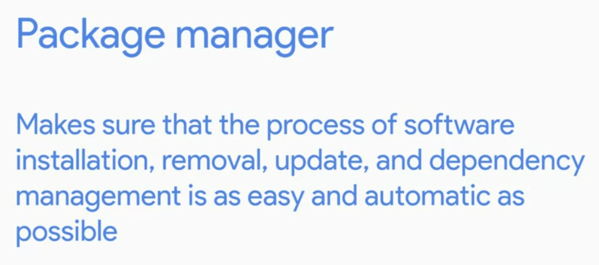

# Week - 3 - Package and Sofware Management.

### <b>Software Packages</b>
  
  
<b>Compression in Windows and Linux through CLI</b>  
Windows:  
Compress-Archive -Path sourcefolder newdestination/filname  
  
Linux:   
7z e zipfilename -> e is to extract. command to archive and unarchive. 

### <b>Installing Debian packages in Linux</b>
command:  
sudo dpkg -i packagename -> install a package.  
sudo dpkg -r packagename -> to remove a package.

### <b>Finding a package in windows</b>
Find-Package packagename -IncludeDependencies

### <b>Register a package source in windows</b>
Register-PackageSource -Name chocolatey -ProviderName chocolatey -Location http://chocolatey.org/api/v2

### <b>Get source package locations in windows</b>
Get-PackageSource

### <b>Install Package from powershell</b>
Install-Package -Name packagename

### <b>Uninstall-package in windows</b>
Uninstall-Package -Name packagename

### <b>Verify package in windows</b>
Get-Package -Name packagename
  
### <b>Package Managers</b>

### <b>List packages in Linux</b>
dpkg -l -> list all program

### <b>Install a package in Linux</b>
sudo apt install packagename

### <b>Remove package in Linux</b>
sudo apt remove packagename

### <b>Update package repository on your system</b>
sudo apt update

### <b>To update packages available on the machine</b>
sudo apt upgrade

### <b>Linux Package Manaers:</b>  
1. apt - advance package manager. It automatically installs the dependencies of a package.
1. dpkg - it only installs the package not the dependencies.

### <b>Drivers</b>
Used to help our hardware devices interact with our operating system.
