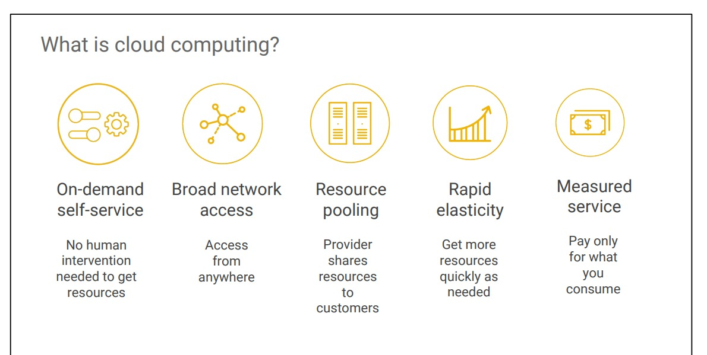

# What is cloud computing ?

Cloud computing has five fundamental attributes,according to the definition proposed by the US NIST.  

First, customers get computing resources on-demand and self service. Cloud-computing customers use an automated interface and get the processing 
power, storage, and network they need, with no need for human intervention.  

Second, they can access these resources over the network.  

Third, the provider of those resources has a big pool of them, and allocates them to 
customers out of the pool. That allows the provider to get economies of scale by 
buying in bulk. Customers don’t have to know or care about the exact physical 
location of those resources.  

Fourth, the resources are elastic. Customers who need more resources can get more 
rapidly. When they need less, they can scale back.  

And last, the customers pay only for what they use or reserve, as they go. If they stop 
using resources, they stop paying
