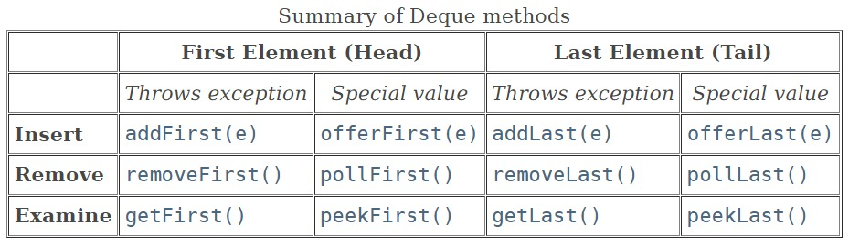
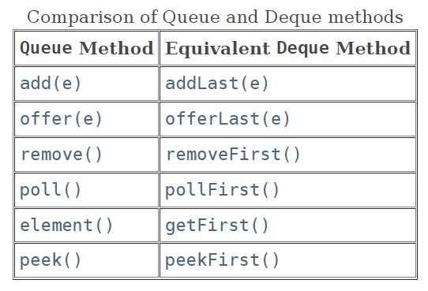

# Deque Interface

- deque short for "double ended queue".
- support element insertion and removal at both ends.
- Extends the Queue interface.

## Super Interfaces
- Collection<E>
- Iterable<E>
- Queue<E>

## Sub Interfaces
- BlockingDeque<E>

## Implementing Classes
- ArrayDeque
- ConcurrentLinkedDeque
- LinkedBlockingDeque
- LinkedList

## Methods

## When Deque is used as Queue than methods equal to Queue methods are: 

# When Deque is used as Stack than methods equals to Stack methods are:
Stack Method	Equivalent Deque Method  
push(e)	        &nbsp;&nbsp;&nbsp;&nbsp;&nbsp;&nbsp;&nbsp;addFirst(e)  
pop()	        &nbsp;&nbsp;&nbsp;&nbsp;&nbsp;&nbsp;&nbsp;removeFirst()  
peek()	        &nbsp;&nbsp;&nbsp;&nbsp;&nbsp;&nbsp;&nbsp;peekFirst()  

- <b>boolean add(E e)</b> - Inserts the specified element into the queue represented by this deque (in other words, at the tail of this deque) if it is possible to do so immediately without violating capacity restrictions, returning true upon success and throwing an IllegalStateException if no space is currently available.

- <b>void addFirst(E e)</b> - Inserts the specified element at the front of this deque if it is possible to do so immediately without violating capacity restrictions, throwing an IllegalStateException if no space is currently available.

- <b>void addLast(E e)</b> - Inserts the specified element at the end of this deque if it is possible to do so immediately without violating capacity restrictions, throwing an IllegalStateException if no space is currently available.

- <b>boolean contains(Object o)</b> - Returns true if this deque contains the specified element.

- <b>Iterator<E> descendingIterator()</b> - Returns an iterator over the elements in this deque in reverse sequential order.

- <b>E element()</b> - Retrieves, but does not remove, the head of the queue represented by this deque (in other words, the first element of this deque).

- <b>E getFirst()</b> - Retrieves, but does not remove, the first element of this deque.

- <b>E getLast()</b> - Retrieves, but does not remove, the last element of this deque.

- <b>Iterator<E> iterator()</b> - Returns an iterator over the elements in this deque in proper sequence.

- <b>boolean offer(E e)</b> - Inserts the specified element into the queue represented by this deque (in other words, at the tail of this deque) if it is possible to do so immediately without violating capacity restrictions, returning true upon success and false if no space is currently available.

- <b>boolean offerFirst(E e)</b> - Inserts the specified element at the front of this deque unless it would violate capacity restrictions.

- <b>boolean offerLast(E e)</b> - Inserts the specified element at the end of this deque unless it would violate capacity restrictions.

- <b>E peek()</b> - Retrieves, but does not remove, the head of the queue represented by this deque (in other words, the first element of this deque), or returns null if this deque is empty.

- <b>E peekFirst()</b> - Retrieves, but does not remove, the first element of this deque, or returns null if this deque is empty.

- <b>E peekLast()</b> - Retrieves, but does not remove, the last element of this deque, or returns null if this deque is empty.

- <b>E poll()</b> - Retrieves and removes the head of the queue represented by this deque (in other words, the first element of this deque), or returns null if this deque is empty.

- <b>E pollFirst()</b> - Retrieves and removes the first element of this deque, or returns null if this deque is empty.

- <b>E pollLast()</b> - Retrieves and removes the last element of this deque, or returns null if this deque is empty.

- <b>E pop()</b> - Pops an element from the stack represented by this deque.

- <b>void push(E e)</b> - Pushes an element onto the stack represented by this deque (in other words, at the head of this deque) if it is possible to do so immediately without violating capacity restrictions, throwing an IllegalStateException if no space is currently available.

- <b>E remove()</b> - Retrieves and removes the head of the queue represented by this deque (in other words, the first element of this deque).

- <b>boolean remove(Object o)</b> - Removes the first occurrence of the specified element from this deque.

- <b>E removeFirst()</b> - Retrieves and removes the first element of this deque.

- <b>boolean removeFirstOccurrence(Object o)</b> - Removes the first occurrence of the specified element from this deque.

- <b>E removeLast()</b> - Retrieves and removes the last element of this deque.

- <b>boolean removeLastOccurrence(Object o)</b> - Removes the last occurrence of the specified element from this deque.

- <b>int size()</b> - Returns the number of elements in this deque.