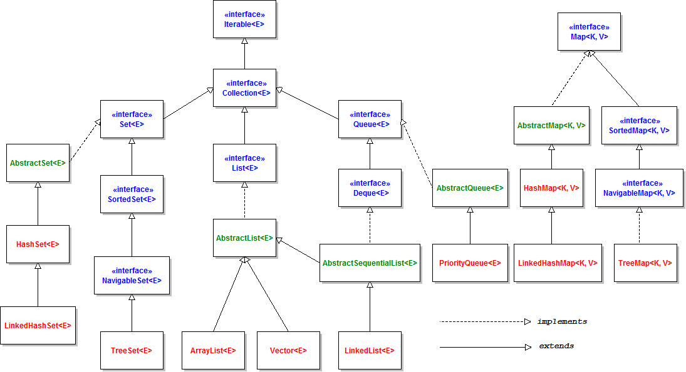
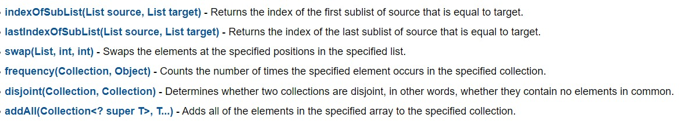

 # Collections Framework

 A collection — sometimes called a container — is simply an object that groups multiple elements into a single unit. Collections are used to store, retrieve, manipulate, and communicate aggregate data. Typically, they represent data items that form a natural group, such as a poker hand (a collection of cards), a mail folder (a collection of letters), or a telephone directory (a mapping of names to phone numbers).  

 A collections framework is a unified architecture for representing and manipulating collections. All collections framework contains the following: 
 - interfaces
 - implementation
 - algorithms

 ## Collections Hierarchy
 
 

- <b>General-purpose implementations. Primary implementations of the collection interfaces.</b>

- <b>Abstract implementations.  
Partial implementations of the collection interfaces to facilitate custom implementations.</b>

- <b>Concurrent implementations.  
Implementations designed for highly concurrent use.</b>

- <b>Special-purpose implementations.  
Implementations designed for use in special situations. These implementations display nonstandard performance characteristics, usage restrictions, or behavior.</b>

- <b>Wrapper implementations.  
Add functionality, such as synchronization, to other implementations.</b>

- <b>Array Utilities.  
Utility functions for arrays of primitive types and reference objects. Not, strictly speaking, a part of the collections framework, this feature was added to the Java platform at the same time as the collections framework and relies on some of the same infrastructure.</b>

- <b>The AbstractCollection, AbstractSet, AbstractList, AbstractSequentialList and AbstractMap classes provide skeletal implementations of the core collection interfaces, to minimize the effort required to implement them.</b>

## List of all interfaces in framework(all childs included)

## Collection Algorithms
The collections framework defines several algorithms that can be applied to collections and maps. These algorithms are defined as static methods within the Collections class.

Several of the methods can throw a ClassCastException, which occurs when an attempt is made to compare incompatible types, or an UnsupportedOperationException, which occurs when an attempt is made to modify an unmodifiable collection.

