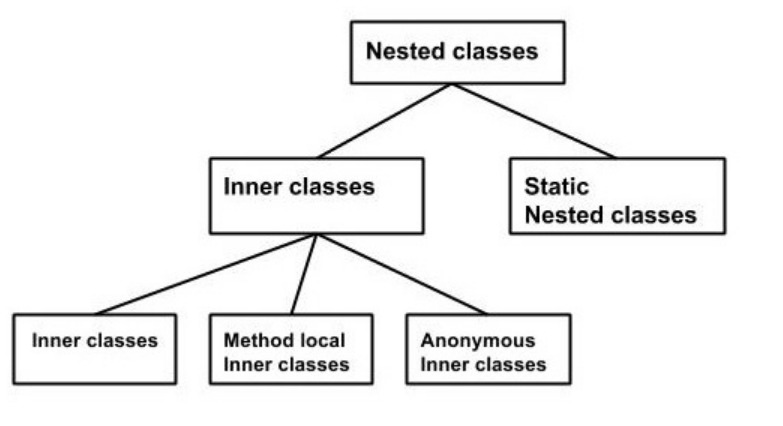

# Inner Classes

A class having another class as its member is called nested class and the one containing nested class is called outer class.  
  
Two types of nested classes:  
- Non Static nested classes
- static nested classes.

Inner classes are of three types depending on where we define them: 
- Inner class
- Method local inner class
- anonymous inner class

## Inner Class
Inner class are made exactly like normal classes.

- <b>Inner class which is made private will be instanciated within a method of the outer class.
</b>
- We can use inner class to access private member of the outer class. To access the inner class we have to make inner class as public. Than to instantiate the inner class, initially you have to instantiate the outer class. Thereafter, using the object of the outer class, following is the way in which you can instantiate the inner class. 
I.E.  
Outer_Demo outer = new Outer_Demo();  
Outer_Demo.Inner_Demo inner = outer.new Inner_Demo();

## Method-Local inner class
We can write a class inside a method and it will be of local-type. The scope of the class will be restricted within the method.  
- It can only be instanciated only with the method where the inner class is defined.

## Anonymous Inner Classes
Inner class declared without a class name is known as an anonymous inner class.
- We declare and instantiate them at the same time.
- They are used whenever we have to override the method of a class or an interface.
- Can also be passed as method arguments.
